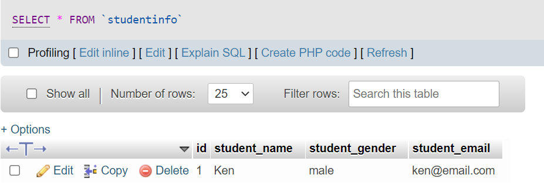
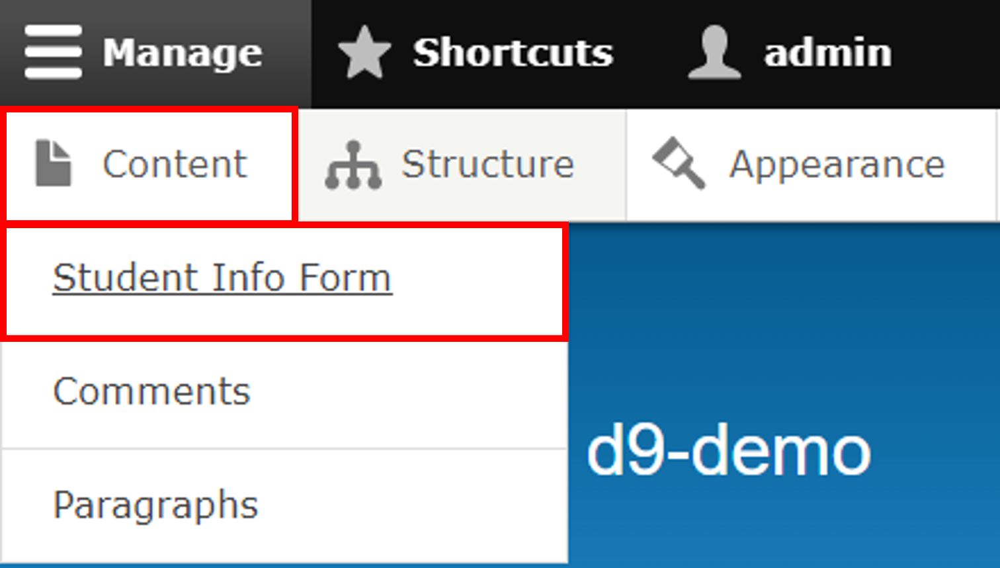

# Sample Code


View my full code


### 1. Folder Structure


### 2. Create Table

First thing you need to do is to create a table for storing your form data. You can do that by including the "**.install**" file on your custom module.&#x20;

I have a table named "**studentinfo**" with **four attributes**

* **id**
* **student\_name**
* **student\_gender**
* **student\_email**

<details>

<summary>my_custom_form.install</summary>

```php
<?php
function my_custom_form_schema() {
  $schema['studentinfo'] = [
    'fields' => [
      'id'=>[
        'type'=>'serial',
        'not null' => TRUE,
      ],
      'student_name'=>[
        'type' => 'varchar',
        'length' => 40,
        'not null' => TRUE,
      ],
      'student_gender'=>[
        'type' => 'varchar',
        'length' => 40,
        'not null' => TRUE,
      ],
      'student_email'=>[
        'type' => 'varchar',
        'length' => 40,
        'not null' => TRUE,
      ],
    ],
    'primary key' => ['id'],
  ];
  return $schema;
}
```

</details>

After enabling your module, visit your DB, you should see the table is created. There is no record yet, so you will see empty table.


.png>)


### 2.1 Build Form

You can see there is "**StudentInfoForm.php**", here is where you create the form.&#x20;

<details>

<summary>StudentInfoForm.php</summary>

```php
<?php

namespace Drupal\my_custom_form\Form;

use Drupal\Core\Form\FormBase;
use Drupal\Core\Form\FormStateInterface;
use Drupal\Core\Database\Database;
use Drupal\Core\Url;
use Symfony\Component\HttpFoundation\RedirectResponse;

/**
 * Form Data
 */
class StudentInfoForm extends FormBase
{
    /**
     * {@inheritdoc}
     */
    public function getFormId()
    {
        return 'studentinfo_form';
    }

    /**
     * {@inheritdoc}
     */
    public function buildForm(array $form, FormStateInterface $form_state)
    {
        $conn = Database::getConnection();
        $record = [];
        if (isset($_GET['id'])) {
            $query = $conn->select('studentinfo', 'si')
                ->condition('id', $_GET['id'])
                ->fields('si');
            $record = $query->execute()->fetchAssoc();
        }

        //Description of the form to be displayed on the user interface
        $form['text_header'] = [
        '#prefix' => '<strong>',
        '#suffix' => '<br><br></strong>',
        '#markup' => $this->t('This is for recording student information.'),
        '#weight' => -100,
        ];

        //Different fields
        $form['student_name'] = [
        '#type' => 'textfield',
        '#title' => $this->t('Student Name'),
        '#required' => true,
        '#default_value' => (isset($record['student_name']) && $_GET['id']) ? $record['student_name'] : '',
        ];

        $form['student_gender'] = [
            '#type' => 'select',
            '#title' => $this->t('Gender'),
            '#options' => [
                'male' => t('Male'),
              'female' => t('Female'),
              'na' => t('Prefer not to say'),
              '#default_value' => (isset($record['student_gender']) && $_GET['id']) ? $record['student_gender'] : '',
            ],
        ];

        $form['student_email'] = [
        '#type' => 'email',
        '#title' => $this->t('Student Email'),
        '#required' => true,
        '#default_value' => (isset($record['student_email']) && $_GET['id']) ? $record['student_email'] : '',
        ];

        //Submit and Reset buttons
        $form['submit'] = [
        '#type' => 'submit',
        '#value' => 'save',
        ];

        $form['reset'] = [
        '#type' => 'button',
        '#value' => 'reset',
        '#attributes' => ['onclick' => 'this.form.reset();return false;',],
        ];
        return $form;
    }

    /**
    * {@inheritdoc}
    */
    public function validateForm(array &$form, FormStateInterface $form_state)
    {
        $student_name = $form_state->getValue('student_name');
        if (preg_match('/[#$%^&*()+=\-\[\]\';,.\/{}|":<>?~\\\\]/', $student_name)) {
            $form_state->setErrorByName('student_name', $this->t('Your name should not include special character(s).'));
        }
        parent::validateForm($form, $form_state);
    }

    /**
     * {@inheritdoc}
     */
    public function submitForm(array &$form, FormStateInterface $form_state)
    {

        $field = $form_state->getValues();

        $student_name = $field['student_name'];
        $student_gender = $field['student_gender'];
        $student_email = $field['student_email'];

        $field = [
            'student_name' => $student_name,
            'student_gender' => $student_gender,
            'student_email' => $student_email,
        ];
        $query = \Drupal::database();
        if (isset($_GET['id'])) {
            //for updating existing record
            $query->update('studentinfo')
                ->fields($field)
                ->condition('id', $_GET['id'])
                ->execute();
            \Drupal::messenger()->addMessage('Successfully saved data from custom form.');
        } else {
            //for inserting new value
            $query->insert('studentinfo')
                ->fields($field)
                ->execute();
            \Drupal::messenger()->addMessage('Successfully saved new data from custom form.');
        }
        drupal_flush_all_caches();
        $form_state->setRedirect('my_custom_form.studentinfo_table_controller_display');
    }
}
```

</details>

We can create form by extending the "**FormBase**"&#x20;

There are three main functions&#x20;

* buildForm
* validateForm  (this is in fact optional, missing this will not affect your form creation)
* submitForm

#### 2.1.1 buildForm

On buildForm function, I have connected to the database. You can also see&#x20;

* student\_name
* student\_gender
* student\_email

#### 2.1.2 validateForm

On the validateForm, I check whether there is special character on the user name.&#x20;

If you use validator and invalid data is entered, the user will not be able to submit the form.


#### 2.2.2 submitForm

On the submitForm, I also have to connect to the database. If the user is updating the existing record, I will use the update; otherwise, I have to insert new value to the DB.

```
$query->update('studentinfo') 
//or
$query->insert('studentinfo')
```

### 2.2 Visit Form

On the ".routing" file, you can specify the location of the form. This time, the path is "_/my\_custom\_form/form/studentinfo/data_"

<details>

<summary>my_custom_form.routing.yml</summary>

```php
my_custom_form.studentinfo_form:
  path: '/my_custom_form/form/studentinfo/data'
  defaults:
    _form: '\Drupal\my_custom_form\Form\StudentInfoForm'
    _title: 'Student Info Form'
  requirements:
    _access: 'TRUE'
```

</details>


If you are curious about how do we know it is setting the path for the form that we want, you can check "**StudentInfoForm.php**", there is a function "**getFormId()**", we have specified the id ("**studentinfo\_form**") there. \
This links to the first line of routing file, "_**my\_custom\_form.studentinfo\_form**_"


#### Visit the form and enter record


After submission of the data, you should see it being inserted to the DB.



### 2.3 Create Link on Menu

&#x20;Instead of entering the url to access to the form everytime, it will be easier to add link on the content menu.&#x20;

In order to do this, you can use the "**my\_custom\_form.links.menu.yml**".&#x20;

<details>

<summary>my_custom_form.links.menu.yml</summary>

```php
my_custom_form.studentinfo_form:
  title: 'Student Info Form'
  route_name: my_custom_form.studentinfo_form
  parent: system.admin_content
  weight: -1
```

</details>



### 2.4 Display Data (Controller)

By using Drupal controller, we can display data that we have.&#x20;

<details>

<summary>StudentInfoController.php</summary>

```php
<?php

namespace Drupal\my_custom_form\Controller;

use Drupal\Core\Controller\ControllerBase;
use Drupal\Core\Database\Database;
use Drupal\Core\Url;
use Drupal\Core\Link;

class StudentInfoController extends ControllerBase
{
    public function display()
    {

        //Table Header
        $header_table = ['id' => t('ID'),
                         'student_name' => t('Name'),
                         'student_gender' => t('Gender'),
                         'student_email' => t('Email'),
                         'opt' => t('Edit'),
                         'opt1' => t('Delete'),];
        $rows = [];

        //Connect to the database and get records from the table
        $conn = Database::getConnection();
        $query = $conn->select('studentinfo', 'si');
        $query->fields('si', ['id','student_name','student_gender','student_email']);
        $results = $query->execute()->fetchAll();

        foreach ($results as $data) {
            $delete = Url::fromUserInput('/my_custom_form/form/studentinfo/delete/' . $data->id);
            $edit = Url::fromUserInput('/my_custom_form/form/studentinfo/data?id=' . $data->id);

            $rows[] = [
                'id' => $data->id,
                'student_name' => $data->student_name,
                'student_gener' => $data->student_gender,
                'student_email' => $data->student_email,
                'opt' => Link::fromTextAndUrl('Edit', $edit)->toString(),
                'opt1' => Link::fromTextAndUrl('Delete', $delete)->toString(),
            ];
        }

        $add = Url::fromUserInput('/my_custom_form/form/studentinfo/data');
        $text = "Add User";


        $form['table'] = [
            '#type' => 'table',
            '#header' => $header_table,
            '#rows' => $rows,
            '#empty' => t('No records found'),
            '#caption' => Link::fromTextAndUrl($text, $add)->toString(),
        ];
        return $form;
    }
}

```

</details>

On the routing file, there is a link specified for the display table. So when you enter&#x20;

[http://localhost/d9-demo/web/my\_custom\_form/display/studentinfo](http://localhost/d9-demo/web/my\_custom\_form/display/studentinfo) You will be able to see all data you have.&#x20;

There are two action buttons&#x20;

1. **edit** \
   The edit button is actually set as follows:\
   `$edit = Url::fromUserInput('/my_custom_form/form/studentinfo/data?id=' . $data->id);`\
   Therefore, when you click into it, it will redirect you to the page of your record
2. **delete**\
   ****It is also the similar for the delete button. \
   It is set as \
   ****`$delete = Url::fromUserInput('/my_custom_form/form/studentinfo/delete/' . $data->id);`\
   ``But be careful, this time it is redirecting to the "**Delete Form**". For the delete form details, it's mentioned [#2.5-delete-data](sample-code.md#2.5-delete-data "mention").

```php
my_custom_form.studentinfo_table_controller_display:
  path: '/my_custom_form/display/studentinfo'
  defaults:
    _controller: '\Drupal\my_custom_form\Controller\StudentInfoController::display'
    _title: 'All Students Info'
  requirements:
    _permission: 'access content'
```

.png>)

### 2.5 Delete Data

On the display table, there is delete option.&#x20;

We are creating a form for that. You can see there is "web\modules\custom\my\_custom\_form\src\Form\DeleteStudentInfoForm.php".

This time, we extend "ConfirmFormBase". But the funtions that we are using are actually similar.&#x20;

<details>

<summary>DeleteStudentInfoForm.php</summary>

```php
<?php

namespace Drupal\my_custom_form\Form;

use Drupal\Core\Form\FormStateInterface;
use Drupal\Core\Form\ConfirmFormBase;
use Drupal\Core\Url;

/**
 * Delete Form Data
 */
class DeleteStudentInfoForm extends ConfirmFormBase
{
    public function getFormId()
    {
        return 'delete_studentinfo_form';
    }

    public $cid;

    public function getQuestion()
    {
        return t('Do you confirm to delete student record?');
    }

    public function getCancelUrl()
    {
        return new Url('my_custom_form.studentinfo_table_controller_display');
    }

    public function getDescription()
    {
        return t('Confirm if you want to delete selected student record');
    }

    public function getConfirmText()
    {
        return t('Confirm Delete');
    }

    public function getCancelText()
    {
        return t('Cancel');
    }

    /**
     * {@inheritdoc}
     */
    public function buildForm(array $form, FormStateInterface $form_state, $cid = null)
    {
        $this->id = $cid;
        return parent::buildForm($form, $form_state);
    }

    /**
     * {@inheritdoc}
     */
    public function validateForm(array &$form, FormStateInterface $form_state)
    {
        parent::validateForm($form, $form_state);
    }

    public function submitForm(array &$form, FormStateInterface $form_state)
    {
        $query = \Drupal::database();
        $query->delete('studentinfo')
              ->condition('id', $this->id)
              ->execute();
        \Drupal::messenger()->addMessage('Successfully delete data.');
        //drupal_flush_all_caches();
        cache_clear_all('*', 'cache_data', true);
        $form_state->setRedirect('my_custom_form.studentinfo_table_controller_display');
    }
}

```

</details>

We have to connect to the DB and perform delete query. This is done by:

```
$query = \Drupal::database();
$query->delete('studentinfo')
      ->condition('id', $this->id)
      ->execute();
```

### Summary

1. &#x20;Using the "_<mark style="background-color:yellow;">module\_name</mark>_<mark style="background-color:yellow;">.install</mark>", we can create table on DB.
2. Using the "<mark style="background-color:yellow;">FormBase</mark>", we can create our form.
3. Using the "_<mark style="background-color:yellow;">module\_name</mark>_<mark style="background-color:yellow;">.links.menu.yml</mark>", we can add item to the menu.
4. Using the "_<mark style="background-color:yellow;">module\_name</mark>_<mark style="background-color:yellow;">.routing.yml</mark>", we can specify URL for forms that we have added.

&#x20;

