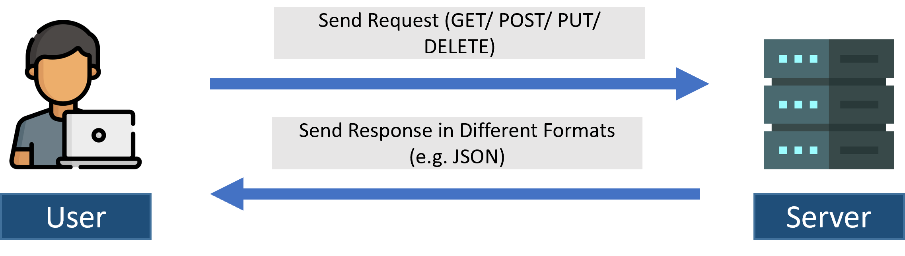

# Custom Restful API

### 1. Understanding RESTFUL API

* REST = Representational State Transfer
* REST API is a way of accessing web services in a simple and flexible way without having any processing.
  * **GET**: to read/ retrieve
  * **POST**: to create
  * **PUT**: to update
  * **DELETE**: to delete

