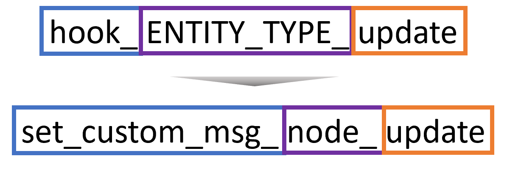

# Sample Code


View my full code


### 1. Folder Structure&#x20;

.png>)

### 2. Enable Module

.png>)

### 3. Code Analysis

Since we are using hook, this module will be triggered when you update a node.&#x20;

#### 3.1 Function Name



* "**hook**" is replaced by your **custom** **module name**&#x20;
* "**ENTITY\_TYPE**" is replaced by "**node**" this time, because I want to detect when node is updated.

#### 3.2 Getting Machine Name of Content Type

You can check your content type machine name on the UI.

#### 3.3 Getting the Machine Name on Your Code

This line of code gets the type of entity (machine name)

```
$type = $entity->getType();
```

#### 3.4 Comparing the Machine Name

Assuming if we update the "page" content type node, then you do something.

```
//check if we are updating node from basic page (machine name: page)
if($type == "page"){
    //set success message
    \Drupal::messenger()->addStatus(t('This is a successful message from the custom hook.'));  
}
```
