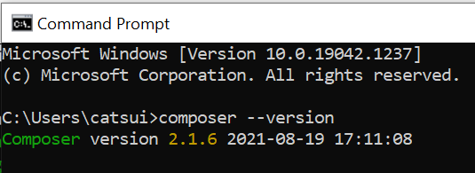
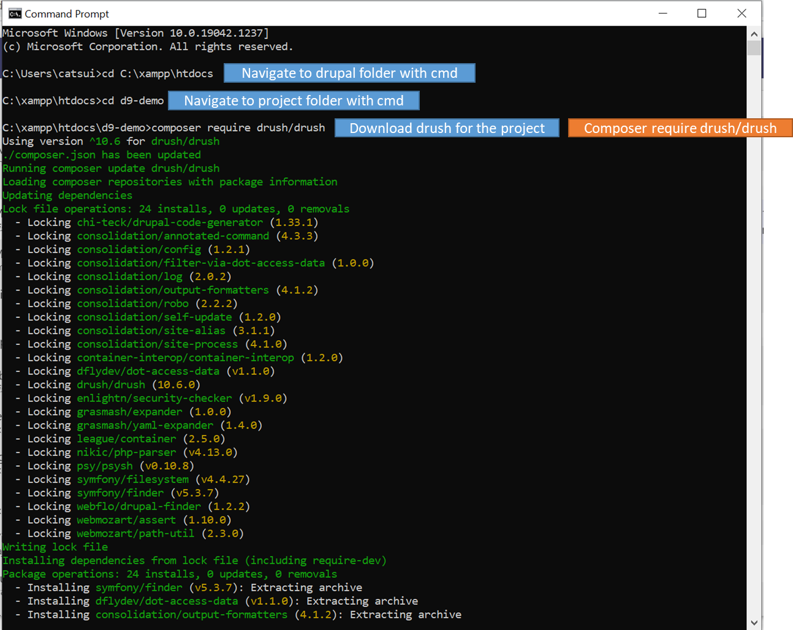

# 1.1 Composer Installation

> Composer can be used to manage Drupal and all dependencies (modules, themes, libraries)

### 1. Install Composer




### 2. After installation, open cmd.

Check composer version by

```
composer --version
```



### 3. Navigate to your drupal folder



### 4. Create new project with composer

```
composer create-project drupal/recommended-project d9-demo
```

.png>)

### 5. Open with browser and setup site

\- Then you are able to setup the site as usual

.png>)
