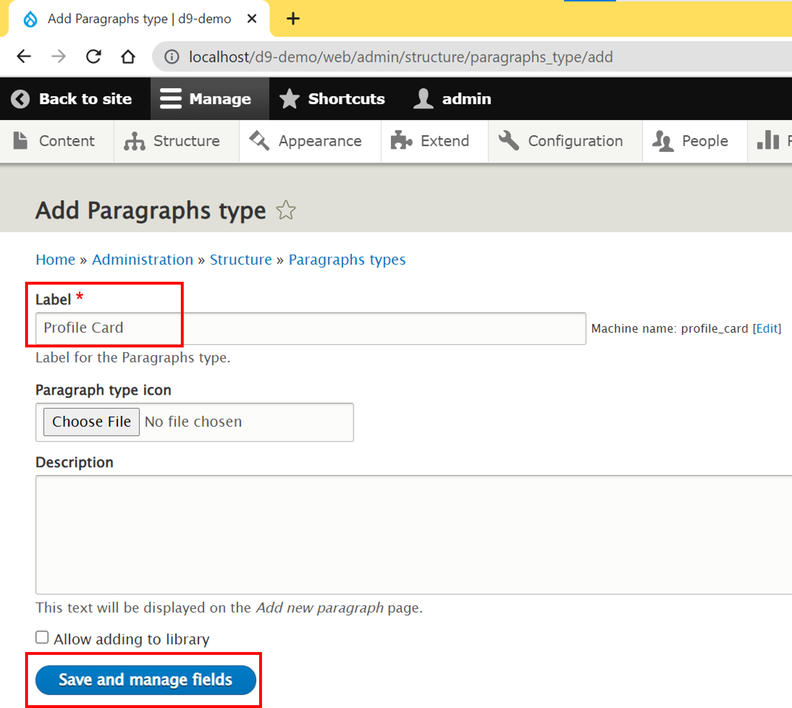
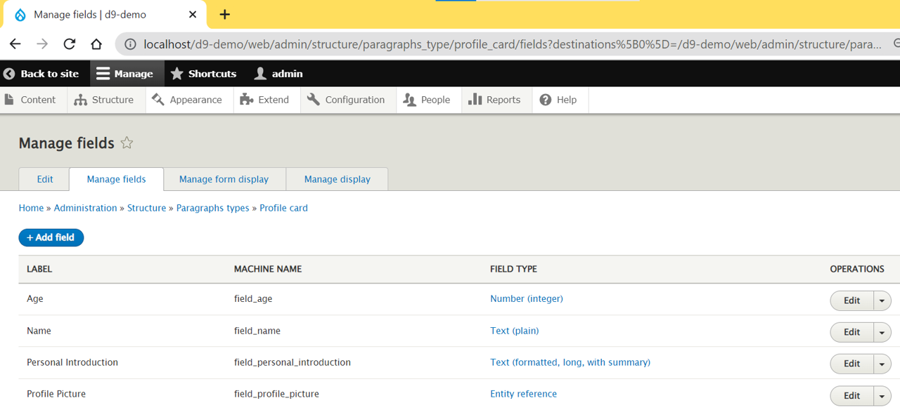
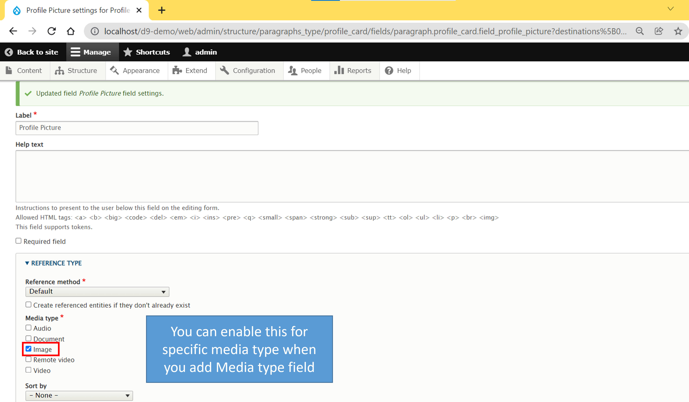

# Create Paragraph Field on Content Type


Steps:


#### 1. Create <mark style="color:orange;">**"Profile Card"**</mark> Paragraphs

.png>)

#### 2. Add more fields to <mark style="color:orange;">**"Profile Card"**</mark>

#### 2.1 Add Media field (image) to the content type

#### 3. Add Paragraph type field to content type <mark style="color:green;">"Users"</mark>

.png>)  (1) (1).png>) .png>)

####
