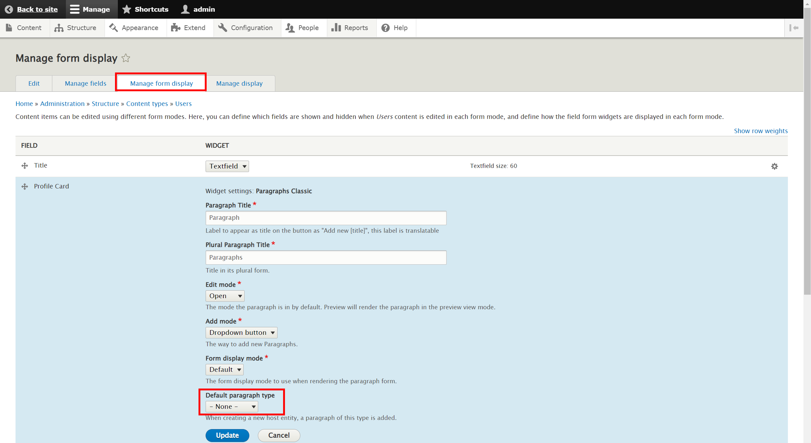
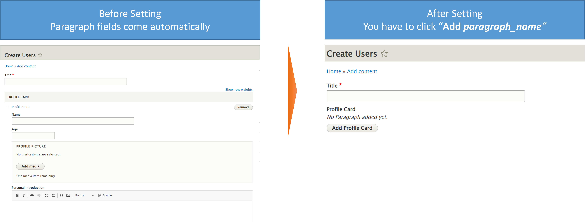

# Field Setting

You may note that paragraph field will be generated automatically even there is no content. You can disable it by changing the **"Manage from display" > "Default paragraph type"**


Result:


When you add new content, you will have to click **"Add \_paragraph\_name**\_**"**

