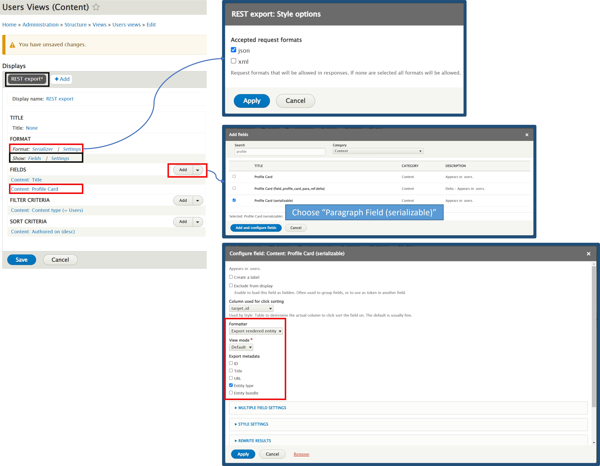

# Views and Paragraphs

It's simple to use views with normal fields; however, story may get complicated when you have paragraph field in your content type. In this case, with the help of REST Views [https://www.drupal.org/project/rest\_views](https://www.drupal.org/project/rest\_views), we are able to serialize the paragraph field.

But if you are not happy with the format generated by the views or you want more control on the format, you may try [custom-restful-api](../../custom-modules/custom-restful-api/ "mention").

#### 1. Download and enable module

 (1) (1) (1).png>)

#### 2. Create Views

 (1).png>)

.png>)




Result:


You are able to get all details within the paragraph field. Key name "field\__card_\_para\_ref\_export".

<details>

<summary>Sample Result</summary>

```
[
  {
    "title": "Male Profile",
    "field_profile_card_para_ref_export": [
      {
        "type": "paragraph",
        "age": "20",
        "name": "Peter",
        "personal_introduction": "<p><strong>Lorem Ipsum</strong> is simply dummy text of the printing and typesetting industry. Lorem Ipsum has been the industry's standard dummy text ever since the 1500s, when an unknown printer took a galley of type and scrambled it to make a type specimen book. It has survived not only five centuries, but also the leap into electronic typesetting, remaining essentially unchanged. It was popularised in the 1960s with the release of Letraset sheets containing Lorem Ipsum passages, and more recently with desktop publishing software like Aldus PageMaker including versions of Lorem Ipsum.</p>",
        "profile_picture": "<article data-quickedit-entity-id=\"media/1\" class=\"contextual-region media media--type-image media--view-mode-default\">\n  <div data-contextual-id=\"media:media=1:changed=1643343154&amp;langcode=en\" data-contextual-token=\"-2y46dUXUUQszaPSHr0kf-ax8abVf6CtmDTG5Qq-5pc\"></div>\n      \n  <div data-quickedit-field-id=\"media/1/field_media_image/en/default\" class=\"field field--name-field-media-image field--type-image field--label-visually_hidden\">\n    <div class=\"field__label visually-hidden\">Image</div>\n              <div class=\"field__item\">  \n\n\n</div>\n          </div>\n\n  </article>\n"
      }
    ]
  }
]
```

</details>

 (1) (1).png>)

### Media Image

From the above response, you can see that the media image is giving out details which we may not interested in. Most often, we want to get the image url only.

#### Get media image url for media field in paragraph
